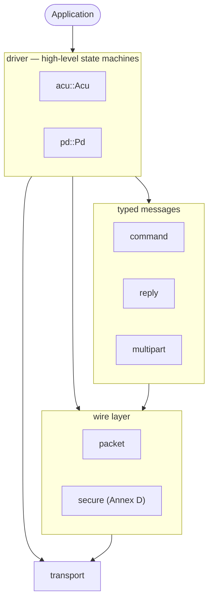

# osdp-rs

`osdp-rs` is a pure-Rust, `no_std`-friendly implementation of the
Security Industry Association's
[Open Supervised Device Protocol (OSDP) v2.2][spec].

[](https://crates.io/crates/osdp)
[](https://docs.rs/osdp)
[](https://codecov.io/gh/Quantumlyy/osdp-rs)

## Status

`v0.2.x` is a ground-up rewrite focused on:

- **Pure Rust, no C FFI.** Trivially cross-compiles to bare-metal targets.
- **`no_std + alloc` by default**, `std` and `secure-channel` opt-in.
- **Total parser** — every error path returns an `Error`; no panics on
  malformed input.
- **Type-state secure session** — invalid SCS sequences (e.g. sending
  `SCS_15` before `SCS_14`) are *compile* errors, not runtime errors.

## Architecture



The Annex D.4 secure-channel handshake is fully type-stated:

```mermaid
stateDiagram-v2
    [*] --> Disconnected: Session::new(scbk)
    Disconnected --> Challenged: challenge(RND.A)
    Challenged --> Cryptogrammed: receive_ccrypt(ccrypt) ✔
    Challenged --> Disconnected: receive_ccrypt(ccrypt) ✘
    Cryptogrammed --> Secure: confirm_rmac_i(mac) ✔
    Cryptogrammed --> Disconnected: confirm_rmac_i(mac) ✘
    Secure --> Secure: mac() / verify()
```

## Crate features

| Feature | Default | Pulls in | Purpose |
|---|---|---|---|
| `std` | ✓ | std + alloc | desktop usage |
| `alloc` | ✓ (via `std`) | alloc | `Vec`/`Box`-using paths |
| `secure-channel` | ✓ | aes, cbc, cipher, subtle, zeroize | Annex D AES-128 + MAC |
| `embedded-io` | | embedded-io | sync byte-stream transport |
| `embedded-io-async` | | embedded-io-async | async byte-stream transport |
| `defmt` | | defmt | structured logging on embedded |

## Implementation matrix

### Commands (Annex A.1)

| Hex | Command | Encode | Decode | Notes |
|-----|--------|:--:|:--:|---|
| `0x60` | `osdp_POLL` | ✓ | ✓ | |
| `0x61` | `osdp_ID` | ✓ | ✓ | |
| `0x62` | `osdp_CAP` | ✓ | ✓ | |
| `0x64` | `osdp_LSTAT` | ✓ | ✓ | |
| `0x65` | `osdp_ISTAT` | ✓ | ✓ | |
| `0x66` | `osdp_OSTAT` | ✓ | ✓ | |
| `0x67` | `osdp_RSTAT` | ✓ | ✓ | |
| `0x68` | `osdp_OUT` | ✓ | ✓ | |
| `0x69` | `osdp_LED` | ✓ | ✓ | |
| `0x6A` | `osdp_BUZ` | ✓ | ✓ | |
| `0x6B` | `osdp_TEXT` | ✓ | ✓ | enforces printable ASCII |
| `0x6E` | `osdp_COMSET` | ✓ | ✓ | |
| `0x73` | `osdp_BIOREAD` | ✓ | ✓ | |
| `0x74` | `osdp_BIOMATCH` | ✓ | ✓ | |
| `0x75` | `osdp_KEYSET` | ✓ | ✓ | |
| `0x76` | `osdp_CHLNG` | ✓ | ✓ | |
| `0x77` | `osdp_SCRYPT` | ✓ | ✓ | |
| `0x7B` | `osdp_ACURXSIZE` | ✓ | ✓ | |
| `0x7C` | `osdp_FILETRANSFER` | ✓ | ✓ | |
| `0x80` | `osdp_MFG` | ✓ | ✓ | |
| `0xA1` | `osdp_XWR` | ✓ | ✓ | opaque `mode + payload` |
| `0xA2` | `osdp_ABORT` | ✓ | ✓ | |
| `0xA3` | `osdp_PIVDATA` | ✓ | ✓ | |
| `0xA4` | `osdp_GENAUTH` | ✓ | ✓ | |
| `0xA5` | `osdp_CRAUTH` | ✓ | ✓ | |
| `0xA7` | `osdp_KEEPACTIVE` | ✓ | ✓ | |

### Replies (Annex A.2)

| Hex | Reply | Encode | Decode | Notes |
|-----|-------|:--:|:--:|---|
| `0x40` | `osdp_ACK` | ✓ | ✓ | |
| `0x41` | `osdp_NAK` | ✓ | ✓ | typed `NakErrorCode` + completion array |
| `0x45` | `osdp_PDID` | ✓ | ✓ | |
| `0x46` | `osdp_PDCAP` | ✓ | ✓ | typed `FunctionCode` lookup |
| `0x48` | `osdp_LSTATR` | ✓ | ✓ | |
| `0x49` | `osdp_ISTATR` | ✓ | ✓ | |
| `0x4A` | `osdp_OSTATR` | ✓ | ✓ | |
| `0x4B` | `osdp_RSTATR` | ✓ | ✓ | |
| `0x50` | `osdp_RAW` | ✓ | ✓ | `iter_bits()` truncates at `bit_count` |
| `0x51` | `osdp_FMT` | ✓ | ✓ | |
| `0x53` | `osdp_KEYPAD` | ✓ | ✓ | |
| `0x54` | `osdp_COM` | ✓ | ✓ | |
| `0x57` | `osdp_BIOREADR` | ✓ | ✓ | |
| `0x58` | `osdp_BIOMATCHR` | ✓ | ✓ | |
| `0x76` | `osdp_CCRYPT` | ✓ | ✓ | |
| `0x78` | `osdp_RMAC_I` | ✓ | ✓ | |
| `0x79` | `osdp_BUSY` | ✓ | ✓ | |
| `0x7A` | `osdp_FTSTAT` | ✓ | ✓ | |
| `0x80` | `osdp_PIVDATAR` | ✓ | ✓ | |
| `0x81` | `osdp_GENAUTHR` | ✓ | ✓ | |
| `0x82` | `osdp_CRAUTHR` | ✓ | ✓ | |
| `0x83` | `osdp_MFGSTATR` | ✓ | ✓ | |
| `0x84` | `osdp_MFGERRR` | ✓ | ✓ | |
| `0x90` | `osdp_MFGREP` | ✓ | ✓ | |
| `0xB1` | `osdp_XRD` | ✓ | ✓ | opaque `mode + payload` |

### Other components

| Component | Status |
|---|---|
| Packet framing (SOM, ADDR, LEN, CTRL, SCB, MAC, trailer) | ✓ |
| CRC-16/KERMIT (Annex C) | ✓ |
| 8-bit checksum trailer | ✓ |
| Multi-part TX iterator + RX assembler (§5.10) | ✓ |
| Function-code table (Annex B) | ✓ |
| Secure channel: AES-128, key derivation, cryptograms | ✓ |
| Secure channel: CBC-MAC w/ rolling ICV + S-MAC1/S-MAC2 swap | ✓ |
| Secure channel: 0x80-padding (MAC + DATA rules) | ✓ |
| Secure channel: type-state `Session<S>` | ✓ |
| AES-128-CBC DATA encryption (SCS_17/18) | ✓ — `Session::seal_data` / `open_data`, plus `secure::frame::seal`/`unseal` |
| ACU driver with SQN cycling and reply-delay enforcement | ✓ |
| ACU driver retry / off-line / BUSY handling | ✓ — see `Acu::exchange` + `RetryConfig` |
| PD driver with command dispatch + reply-repeat semantics | ✓ |
| `embedded-io` transport adapter | ✓ — `transport::EmbeddedIoTransport` |
| Async transport (`embedded-io-async`) | future |
| Serial-port adapter (`osdp-serial` companion crate) | future |
| Chaos-bus testing (plan §6 Layer 3) | ✓ — `tests/chaos_bus.rs` |

## Quick start

```rust
use osdp::clock::SystemClock;
use osdp::command::{Command, Poll};
use osdp::driver::acu::{Acu, ExchangeOutcome, PdState};
use osdp::reply::Reply;
use osdp::transport::VecTransport;

let mut acu = Acu::new(VecTransport::new(), SystemClock::new());
let mut pd = PdState::default();
match acu.exchange(0x05, &mut pd, &Command::Poll(Poll))? {
    ExchangeOutcome::Reply(Reply::Ack(_)) => println!("PD alive"),
    ExchangeOutcome::Busy => println!("retry later"),
    ExchangeOutcome::Timeout => println!("missed reply"),
    ExchangeOutcome::Offline => println!("declared off-line"),
    _ => {}
}
# Ok::<(), osdp::Error>(())
```

For the secure-channel walk, see `examples/handshake.rs`. For an end-to-end
loopback that exercises SQN cycling, see `examples/loopback_poll.rs`.

## Testing

```sh
cargo test                              # 173 unit + 14 integration tests
cargo test --no-default-features        # `no_std` slice still compiles
cargo clippy --all-targets --all-features
cargo run --example loopback_poll
cargo run --example handshake
```

## License

BSD-3-Clause.

[spec]: https://www.securityindustry.org/industry-standards/open-supervised-device-protocol/
